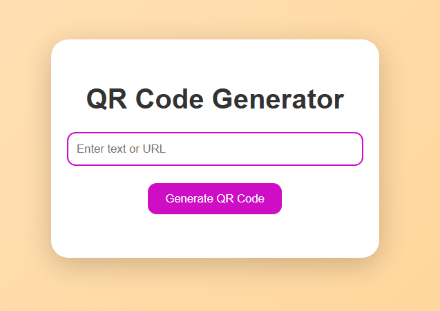

# QR Code Generator

A clean, simple QR code generator built with **HTML**, **CSS**, and **Vanilla JavaScript**, using the [qrcode](https://www.npmjs.com/package/qrcode) library via CDN. No dependencies or build tools required.

---

## 💻 Live Demo

- [⛓️‍💥 Demo](https://web-qr-code-generator-steel.vercel.app/)

---

## 📷 Screenshots

<p align="center">
  
</p>

<br>

<p align="center">
  
</p>

---

## 🔍 Features

- Generate QR codes from any text or URL
- Instant preview inside a `<canvas>`
- Styled responsive UI
- Uses QRCode.js (via CDN) to render canvas output

---

## 📂 Project Structure

- .
- ├── index.html              # Main HTML file
- ├── style.css               # UI styling and layout
- ├── script.js               # JS logic using QRCode.toCanvas
- ├── .gitignore              # Git exclusions
- ├── LICENSE                 # Open-source license (MIT)
- └── README.md               # Documentation

---

## ✅ How to Use

1. Clone the repository:
   ```bash```
   git clone https://github.com/xAndreiix/Web_QR_Code_Generator.git
   
   cd qr-code-generator
2. Open index.html in your browser.
3. Enter any text or URL and click Generate QR Code.

---

## 💡 Notes

- QR codes are generated using the QRCode.toCanvas() function.
- Canvas is appended directly to the DOM.
- Input is validated to ensure it's not empty.

---

## 📄 License

This project is licensed under the MIT License.

---

## 👨‍💻 Author

Andrei Iliescu – Focused on creating clean and functional browser tools.
